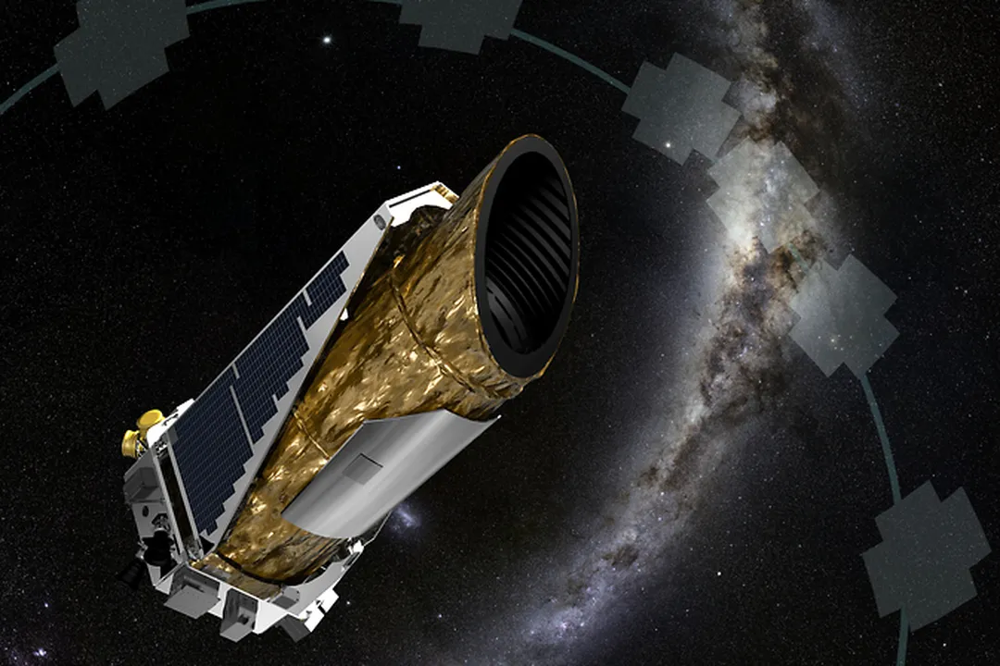

# PHYS 549 Group Project: Estimating exoplanet radii with Kepler light curves
**Authors:  Bolu Feng, Nick Proietti, Deekshit Vedula**
<br/>
**Team Name: Little Green Men (LGM)**
<br/>
<br/>
This repository is a shared workspace for the PHYS 549 group project at Rice University by LGM. The goal of this project is to link
light curve features, exoplanet, and host star parameters in existing data collected by the *Kepler* mission with exoplanet radii estimates through regression using neural networks.

<p float="left">
  
   
</p>

*Left*: A basic picture of the exoplanet transit method (Source: *The Planetary Society*). *Right*: Kepler Space Telescope (Source: *NASA*).

## Regression analysis of exoplanet radii using neural networks
### Required files
1. KIC_FIRST_100.csv
2. KOI.csv

The dictionary to the data columns in the Kepler Object of Interest (KOI) table may be found [here](https://exoplanetarchive.ipac.caltech.edu/docs/API_kepcandidate_columns.html).

The Kepler light curve data was formerly acquired through the [Mikulski Archive for Space Telescopes (MAST)](https://stdatu.stsci.edu/kepler/genops.html) and is currently acquired through the [lightkurve package](https://docs.lightkurve.org/).

### Main Codes
`LC_FFT_CNN` is the file in which we are trying to remove dominant frequencies from the LC and train it using a convolutional neural network (In progress)

`XGB_Kepler` is the file in which we have used an XGB Regressor to train using KOI parameters to predict exoplanet radius

`Light_Curve_Simulation` is the file in which we are trying to simulate an exoplanet transit light curve (In Progress)

`Kepler_Light_Curve_Reader` is the file that illustrates the learning journey of the authors to acquire, wrangle, explore, and use the Kepler data for modeling. Regression efforts using [Multi-layer Perceptron regressors](https://scikit-learn.org/stable/modules/generated/sklearn.neural_network.MLPRegressor.html#sklearn.neural_network.MLPRegressor) start under the section *Working with Kepler Light Curve Data from Kepler Object of Interest (KOI) Table* in the code. This code currently uses KOI parameters of the exoplanet and the host star as inputs and exoplanet radii as outputs. Immediate future work will add light curves as inputs and improve the regressors (In Progress).

### Notes
When running these codes in Google Colab, some libraries may not be already installed (e.g. *lightkurve*, *astroquery*). To install the necessary libraries, run in a cell

```
!pip install library_name
```

replacing `library_name` with the necessary library.
